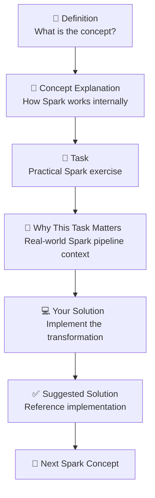
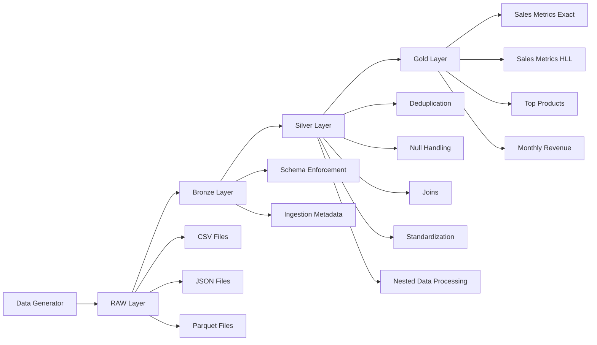
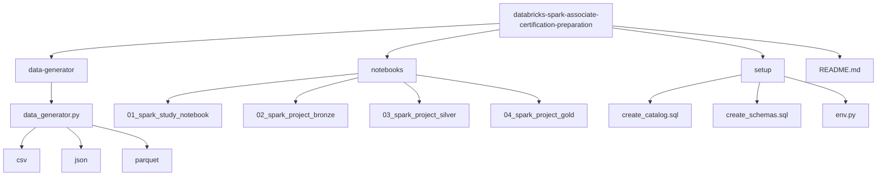

# Databricks Spark Associate Certification Preparation

A hands-on project to help Engineers prepare for the **Databricks
Certified Developer for Apache Spark Associate** certification while
building a realistic Spark data pipeline.

This repository combines **conceptual learning** and a
**production-style Spark project** using PySpark and Spark SQL.

------------------------------------------------------------------------

# Project Goals

-   Provide a practical study path for the Databricks Spark
    certification
-   Demonstrate Spark transformations and Spark SQL in a real pipeline
-   Simulate a Lakehouse-style architecture
-   Offer open learning material for the community

------------------------------------------------------------------------
# Laboratory Learning Structure

The Bronze, Silver and Gold notebooks follow a **laboratory-style
learning format** designed to reinforce both conceptual understanding
and practical implementation.

Each topic in the notebooks follows the structure below:

1. **Definition**  
   Introduction to the concept being studied.

2. **Concept**  
   Explanation of how the Spark feature works and when it is used.

3. **Task**  
   A practical exercise where the reader must implement the concept.

4. **Why This Task Matters**  
   Explanation of why the operation is important in real Spark
   pipelines.

5. **Your Solution**  
   The section where the reader should implement their own solution.

6. **Suggested Solution**  
   A reference implementation showing one possible way to solve the
   task.

This structure encourages **active learning**, allowing readers to first
think about the problem before reviewing the suggested solution.


------------------------------------------------------------------------
# Technologies

-   Apache Spark
-   PySpark
-   Spark SQL
-   Databricks concepts
-   Lakehouse Architecture
-   Delta Lake

Key topics covered:

-   Transformations vs Actions
-   Lazy Evaluation
-   Catalyst Optimizer
-   Shuffle operations
-   Partitioning strategies
-   Join strategies
-   Window functions
-   Nested data processing
-   HyperLogLog approximations (`approx_count_distinct`)

------------------------------------------------------------------------

# Project Architecture



The project simulates a simplified **Lakehouse architecture**:

RAW → BRONZE → SILVER → GOLD

Each layer demonstrates different Spark transformations and optimization
concepts.

------------------------------------------------------------------------

# Repository Structure



------------------------------------------------------------------------

# Data Generator

The repository includes a synthetic data generator that creates **sales
datasets** in multiple formats:

-   CSV
-   JSON
-   Parquet

Tables generated:

-   customers
-   products
-   orders
-   order_items

The data intentionally includes quality issues:

-   duplicated rows
-   null values
-   inconsistent formatting
-   skewed distributions
-   nested JSON arrays

Example nested JSON:

``` json
{
  "order_id": 101,
  "customer_id": 12,
  "items": [
    {
      "product_id": 44,
      "attributes": [
        {"key": "color", "value": "red"},
        {"key": "size", "value": "M"}
      ]
    }
  ]
}
```

This enables testing Spark functions like:

-   explode()
-   flatten()
-   from_json()
-   get_json_object()

------------------------------------------------------------------------

# Notebook 1 --- Spark Study Notebook

Focused on **concept learning and certification preparation**.

Includes:

-   Concept explanations
-   PySpark examples
-   Spark SQL examples
-   Exercises

------------------------------------------------------------------------

# Notebook 2 --- Spark Project Pipeline

A **production-style Spark pipeline** applying common Data Engineering
practices.

Pipeline stages:

RAW\
Ingestion of CSV, JSON and Parquet files.

BRONZE\
- schema enforcement\
- ingestion timestamp

SILVER\
- missing data handling (`fillna`, `dropna`)\
- deduplication (`distinct`, `dropDuplicates`)\
- column transformations\
- nested JSON processing (`flatten`, arrays, structs)\
- joins between datasets\
- partition optimization (`repartition`, `coalesce`)

GOLD

Analytical datasets built using aggregations and window functions:

-   **sales_metrics_exact** (exact aggregations)
-   **sales_metrics_hll** (HyperLogLog approximation)
-   **top_products**
-   **monthly_revenue**

Example Spark operations used:

-   select
-   filter
-   withColumn
-   groupBy
-   agg
-   join
-   explode
-   flatten
-   approx_count_distinct
-   window functions
-   repartition / coalesce
-   partitionBy

------------------------------------------------------------------------

# How to Use

### 1. Clone the repository

    git clone https://github.com/<your-user>/databricks-spark-associate-certification-preparation

### 2. Generate synthetic data

Run the data generator.

### 3. Open the notebooks

Use Databricks or any Spark environment.

### 4. Study the concepts

Follow **Notebook 1**.

### 5. Run the pipeline

Execute the **Bronze → Silver → Gold notebooks**.

Each notebook follows the **laboratory learning structure** described
earlier:

- Definition
- Concept explanation
- Task
- Why the task matters
- Your Solution (where you implement the logic)
- Suggested Solution

This format allows readers to practice implementing Spark transformations
before reviewing the reference implementation.

------------------------------------------------------------------------

# Learning Outcomes

After completing this project you will understand:

-   how Spark executes jobs
-   how partitioning affects performance
-   how Spark optimizes queries
-   how to process nested data
-   how to build analytical data layers
-   how to compare exact vs approximate aggregations (HyperLogLog)

------------------------------------------------------------------------

# Study Note

⚠️ **Important**

This laboratory includes **suggested solutions** for the exercises and
pipeline tasks.

Feel free to evolve the project by:

-   adding new transformations
-   improving data quality rules
-   experimenting with Spark optimizations
-   creating additional analytical datasets

The goal is to use this repository as a **learning foundation** and
evolve it into a **personal Data Engineering case study**.

------------------------------------------------------------------------

# References

Apache Spark Documentation\
https://spark.apache.org/docs/latest/

Databricks Documentation\
https://docs.databricks.com/

Spark SQL Guide\
https://spark.apache.org/docs/latest/sql-programming-guide.html

------------------------------------------------------------------------

# Contributions

Contributions are welcome.

Feel free to open issues or pull requests to improve the project.
