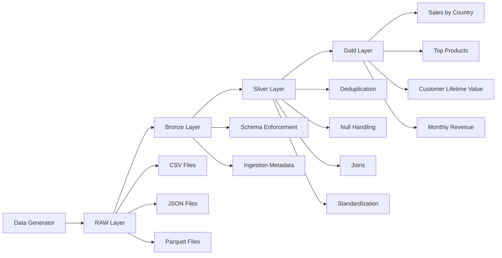
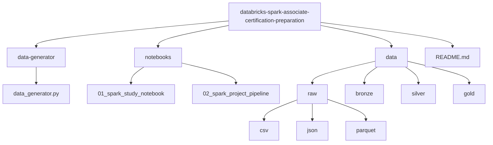

# Databricks Spark Associate Certification Preparation

A hands-on project to help Data Engineers prepare for the **Databricks
Certified Developer for Apache Spark Associate** certification while
building a realistic Spark data pipeline.

This repository combines **conceptual learning** and a
**production-style Spark project** using PySpark and Spark SQL.

------------------------------------------------------------------------

# Project Goals

-   Provide a practical study path for the Databricks Spark
    certification
-   Demonstrate Spark transformations and Spark SQL in a real pipeline
-   Simulate a Lakehouse-style architecture
-   Offer open learning material for the community

------------------------------------------------------------------------

# Technologies

-   Apache Spark
-   PySpark
-   Spark SQL
-   Databricks concepts
-   Lakehouse Architecture

Key topics covered:

-   Transformations vs Actions
-   Lazy Evaluation
-   Catalyst Optimizer
-   Shuffle operations
-   Partitioning strategies
-   Join strategies
-   Window functions
-   Nested data processing

------------------------------------------------------------------------

# Project Architecture



The project simulates a simplified **Lakehouse architecture**:

RAW → BRONZE → SILVER → GOLD

Each layer demonstrates different Spark transformations and optimization
concepts.

------------------------------------------------------------------------

# Repository Structure



------------------------------------------------------------------------

# Data Generator

The repository includes a synthetic data generator that creates **sales
datasets** in multiple formats:

-   CSV
-   JSON
-   Parquet

Tables generated:

-   customers
-   products
-   orders
-   order_items

The data intentionally includes quality issues:

-   duplicated rows
-   null values
-   inconsistent formatting
-   skewed distributions
-   nested JSON arrays

Example nested JSON:

``` json
{
  "order_id": 101,
  "customer_id": 12,
  "items": [
    {
      "product_id": 44,
      "attributes": [
        {"key": "color", "value": "red"},
        {"key": "size", "value": "M"}
      ]
    }
  ]
}
```

This enables testing Spark functions like:

-   explode()
-   flatten()
-   from_json()
-   get_json_object()

------------------------------------------------------------------------

# Notebook 1 --- Spark Study Notebook

Focused on **concept learning and certification preparation**.

Includes:

-   Concept explanations
-   PySpark examples
-   Spark SQL examples
-   Exercises

------------------------------------------------------------------------

# Notebook 2 --- Spark Project Pipeline

A concise **production-style Spark pipeline** applying best practices.

Pipeline stages:

RAW\
Ingestion of CSV, JSON and Parquet files.

BRONZE\
- schema enforcement\
- ingestion timestamp

SILVER\
- deduplication\
- null handling\
- joins\
- normalization

GOLD\
Analytical tables such as:

-   sales_by_country
-   top_products
-   customer_lifetime_value
-   monthly_revenue

Example Spark operations used:

-   select
-   filter
-   withColumn
-   groupBy
-   agg
-   join
-   explode
-   flatten
-   window functions

------------------------------------------------------------------------

# How to Use

### 1. Clone the repository

git clone
https://github.com/`<your-user>`{=html}/databricks-spark-associate-certification-preparation

### 2. Generate synthetic data

Run the data generator.

### 3. Open the notebooks

Use Databricks or any Spark environment.

### 4. Study the concepts

Follow **Notebook 1**.

### 5. Run the pipeline

Execute **Notebook 2**.

------------------------------------------------------------------------

# Learning Outcomes

After completing this project you will understand:

-   how Spark executes jobs
-   how partitioning affects performance
-   how Spark optimizes queries
-   how to process nested data
-   how to build analytical data layers

------------------------------------------------------------------------

# References

Apache Spark Documentation\
https://spark.apache.org/docs/latest/

Databricks Documentation\
https://docs.databricks.com/

Spark SQL Guide\
https://spark.apache.org/docs/latest/sql-programming-guide.html

------------------------------------------------------------------------

# Contributions

Contributions are welcome.

Feel free to open issues or pull requests to improve the project.
